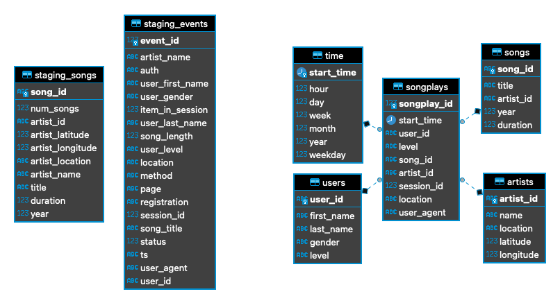

# Data Warehouse with AWS
## Introduction
A music streaming startup, Sparkify, has grown their user base and song database and want to move their processes and data onto the cloud. Their data resides in S3, in a directory of JSON logs on user activity on the app, as well as a directory with JSON metadata on the songs in their app.

As their data engineer, you are tasked with building an ETL pipeline that extracts their data from S3, stages them in Redshift, and transforms data into a set of dimensional tables for their analytics team to continue finding insights in what songs their users are listening to. You'll be able to test your database and ETL pipeline by running queries given to you by the analytics team from Sparkify and compare your results with their expected results.

## Project Description
In this project, I applied what I've learned on data warehouses and AWS to build an ETL pipeline for a database hosted on Redshift. To complete the project, I needed to load data from S3 to staging tables on Redshift and execute SQL statements that create the analytics tables from these staging tables.

## Project files:
- `create_table.py`: create fact and dimension tables for the star schema in Redshift.
- `etl.py`: load data from `S3` into staging tables on `Redshift` and then process that data into analytics tables on `Redshift`.
- `sql_queries.py`: define SQL statements, which will be imported into the two other files above.

## Database Schema Design

Star schema which is optimized for queries on song play analysis. This includes the following tables.

### Fact Table
- songplays - records in event data associated with song plays i.e. records with page NextSong
### Dimension Tables
- users - users in the app
- songs - songs in music database
- artists - artists in music database
- time - timestamps of records in songplays broken down into specific units

